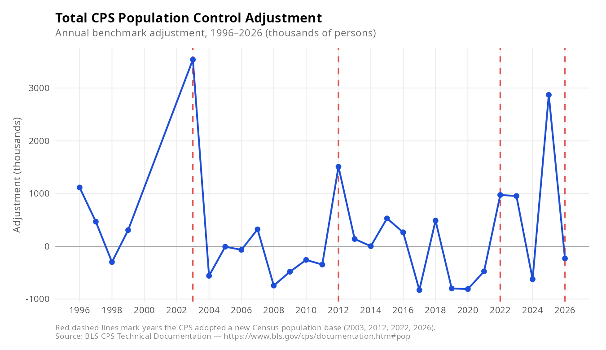

# CPS Population Control Adjustments

Historical data of annual population control adjustments applied to the
[Current Population Survey (CPS)](https://www.bls.gov/cps/), 1996–2026.

## About the data

Each year the BLS applies a population control adjustment to the CPS to keep survey-based population
estimates aligned with updated Census Bureau benchmarks. This repository tracks the size of those
annual adjustments (in thousands of persons) across total population and demographic subgroups
(White, Black, Hispanic, Male, Female).

**The data was collected by hand** directly from the population control tables on the
[BLS CPS Technical Documentation page](https://www.bls.gov/cps/documentation.htm#pop).
No automated download or API was used. There is no published data for 2000–2002.
Red dashed lines in the charts mark years when the CPS adopted a new Census-based population
estimate series: **2003, 2012, 2022, and 2026**.

> **Note on sex breakdowns:** The Male and Female figures for 1999 and 2003–2011 reflect
> persons aged 20 and older only, as that was the only breakdown published for those years.

## Example: Total adjustment



## Files

| Path | Description |
|------|-------------|
| `data/popcontrols_cps1996_2026.csv` | Source data |
| `generate_plots.R` | R script (ggplot2) that produces all charts |
| `plots/` | Generated SVG and PNG chart files |
| `index.html` | GitHub Pages site with toggle between chart views |

## Viewing the site

The site is hosted via GitHub Pages. To regenerate the charts after updating the CSV, run:

```r
Rscript generate_plots.R
```
